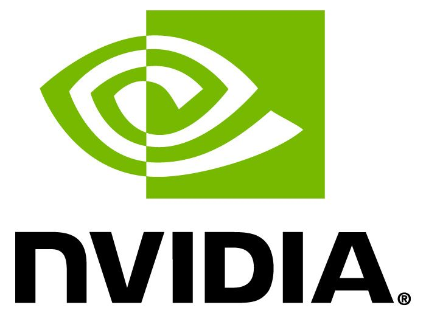

  
   

# Cloud-Based Data Science at the Speed of Thought Using RAPIDS - the Open GPU Data Science Ecosystem

## 
KDD-2019 Tutorial

Data science is the exploration of vast amounts of data to discover actionable knowledge. It is about finding answers to hard questions and involves trial and error over multiple iterations.  The data scientist’s job is not easy; after all, if you know how to find the answer then you do not need a data scientist.  To increase productive, the data scientist uses tools within the Python ecosystem, such as Pandas, Numpy, and Scikit-learn. While Python is the defacto standard for data science, it suffers from poor performance.  This make the data scientist’s job hard since the amount of time they spend waiting for results interrupts their train of thought.  We must strive to make the data scientist environment more productive.  As larger and larger amount of data is required to be explored, the amount of time waiting for results also increases. 

The RAPIDS suite of open source software libraries gives the data scientist the freedom to execute end-to-end data science and analytics pipelines on GPUs.  RAPIDS is incubated by NVIDIA based on years of accelerated analytics experience.  RAPIDS relies on NVIDIA CUDA primitives for low-level compute optimization and exposes GPU parallelism and high-bandwidth memory speed through user-friendly Python interfaces.  Through a familiar DataFrame API that integrates with a variety of machine learning algorithms, RAPIDS facilitates common data preparations tasks while removing typical serialization costs. RAPIDS includes support for multi-GPU deployments, enabling vastly accelerated processing and training on large dataset sizes.

Join NVIDIA’s engineers as they walk through a collection of data science problems that introduce components and features of RAPIDS, including: feature engineering, data manipulation, statistical tasks, machine learning, and graph analysis. This tutorial focuses on accelerating a large data science workflow in Python on a multiple GPU. 

## Agenda:

1. Introduction (not hands-on) 
   1. Speaker Introduction
   2. Why RAPIDS
   3. Getting Connected to VMs 
   4. Break - 5 min
2. Tutorial (hands-on)
   1. Classification of astronomical sources - 45 min 
   2. Break - 5 min
   3. Finding commonalities within populations - 45 min
   4. Break - 5 min
   5. Cyber flagging anomalous network communications - 45 min
   6. Break - 5 min
3. Conclusion (not hands-on)
   1. DASK Example (Multi-GPU 
   2. Roadmap 
   3. Conclusion

**Workflow 1**
Classification of astronomical sources in the night sky is important for understanding the universe. It helps us understand the properties of what makes up celestial systems from our solar system to the most distant galaxy and everything in between. The Photometric LSST Astronomical Time-Series Classification Challenge (PLAsTiCC) wanted to revolutionize the field by automatically classifying 10–100x faster than previous methods and provided Kagglers a great dataset for solving this Kaggle problem using machine learning. The workflow comes from the RAPIDS submission to the Kaggle challenge, which came in 8th place out of 1094 submissions.

**Workflow 2**
Finding commonalities within populations, counted in hundreds of millions, and with tens of millions of distinct feature values, is a non-trivial task. Current techniques employ variations of FP-Tree algorithms to extract useful patterns. In this tutorial we will showcase an end-to-end novel approach to finding frequent patterns using cuGraph capabilities available in RAPIDS.

**Workflow 3**
Computer networks generate massive amounts of heterogeneous data as users interact with other users, computers, and services. These interactions can be modeled as large, heterogeneous property graphs, with multidimensional characteristics of the communication embedded on an edge connecting nodes. Current techniques to identify subgraph evolution over time and extract anomalies require lengthy compute times or necessitate significant pre-filtering of the graph. In this tutorial, we showcase an approach to flagging anomalous network communications in a large graph using a combination of structural graph features and graph analytics, running end-to-end in RAPIDS.
