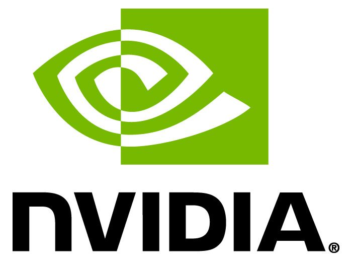

<p float="left">
  <br/><br/>
  <br/><br/>
  
</p>

# Accelerating and Expanding End-to-End Data Science Workflows with DL/ML Interoperability Using RAPIDS

## KDD 2020 Tutorial
The lines between data science (DS), machine learning (ML), deep learning (DL), and data mining continue to be blurred and removed. This is great as it ushers in vast amounts of capabilities, but it brings increased complexity and a vast number of tools/techniques. It’s not uncommon for DL engineers to use one set of tools for data extraction/cleaning and then pivot to another library for training their models. After training and inference, it’s common to then move data yet again by another set of tools for post-processing. The ​RAPIDS​ suite of open source libraries not only provides a method to execute and accelerate these tasks using GPUs with familiar APIs, but it also provides interoperability with the broader open source community and DL tools while removing unnecessary serializations that slow down workflows. GPUs provide massive parallelization that DL has leveraged for some time, and RAPIDS provides the missing pieces that extend this computing power to more traditional yet important DS and ML tasks (e.g., ETL, modeling). Complete pipelines can be built that encompass everything, including ETL, feature engineering, ML/DL modeling, inference, and visualization, all while removing typical serialization costs and affording seamless interoperability between libraries. All

experiments using RAPIDS can effortlessly be scheduled, logged and reviewed using existing public cloud options.
Join our engineers and data scientists as they walk through a collection of DS and ML/DL engineering problems that show how RAPIDS running on Azure ML can be used for end-to-end, entirely GPU pipelines. This tutorial includes specifics on how to use RAPIDS for feature engineering, interoperability with common ML/DL packages, and creating GPU native visualizations using ​cuxfilter​. The use cases presented here give attendees a hands-on approach to using RAPIDS components as part of a larger workflow, seamlessly integrating with other libraries (e.g., PyTorch) and visualization packages.

## Agenda:
1. Introduction (not hands-on) [20 min]
	1. Speaker Introductions
	2. Getting Connected to the VM Instances
	3. Why RAPIDS, and How RAPIDS Connects to the Larger Ecosystem
2. Tutorial (hands-on) [2 hours 20 min]
	1. [New York Taxi Data](./notebooks/Taxi/NYCTax.ipynb)
      	1. In troduction to RAPIDS via an analysis of the New York City taxi data set
      	2. Key Libraries: cuDF, cuML, cuGraph, cuXfilter​
	2. [Deep Learning for Tabular Data](nvtabular/rossmann-store-sales-example.ipynb)
		1. Perform store sales prediction using tabular deep learning​
		2. Key Libraries: NVTabular, cuDF, TensorFlow​
	3. [Single-Cell RNA Sequencing Analysis](notebooks/Lungs/hlca_lung_gpu_analysis.ipynb)
		1. Analyzing gene expression from a population of cells from a human lung​
		2. Key Libraries: scanpy, cuDF, cuML, cuGraph​
	4. [Where to Park](./notebooks/parking/codes/)
		1. Analyzing Seattle Parking data and determining the best parking spot within a walkable distance from Space Needle​
		2. Key Libraries: cuSpatial, cuDF, cuGraph​
    5. CyBERT
       1. Cyber Log Parsing using Neural Networks and Language Based Model​
       2. Key Libraries: CLX, cuDF, PyTorch​
3. Conclusions (not hands-on) [15 min]
	5. Future Improvements / Roadmap
	6. Any Additional Questions

## Configuring Your Environment
This tutorial requires RAPIDS and a modern GPU (Pascal architecture or newer). It makes use of multiple GPU packages and CUDA 10.2. In order to make this process as simple as possible, we've created detailed instructions to get a RAPIDS nightly container modified for the notebooks in this repo. Follow the steps outlined below. For the purposes of these instructions, we assume usage of Ubuntu 18.04, CUDA 10.2, and Python 3.7.

#### 1. Pull the RAPIDS nightly container for your environment by visiting the [Getting Started](https://rapids.ai/start.html) page

```
docker pull rapidsai/rapidsai-nightly:cuda10.2-runtime-ubuntu18.04-py3.7
```

#### 2. Start the container

```
docker run --gpus all -it -p 8888:8888 -p 8787:8787 -p 8786:8786 --name kdd_rapids \
	rapidsai/rapidsai-nightly:cuda10.2-runtime-ubuntu18.04-py3.7
```

You should now be at a prompt inside the container that looks like this:

```
(rapids) root@aa3f80497e9c:/rapids/notebooks#
```

If it does not, attach to the container you just created by running:

```
docker attach kdd_rapids
```

#### 3. Clone this Git repo

```
git clone https://github.com/rapidsai-community/notebooks-contrib.git
```

#### 4. Change directories to the KDD 2020 directory

```
cd /rapids/notebooks/notebooks-contrib/conference_notebooks/KDD_2020/
```

#### 5. Run the KDD initial setup script

```
sh kdd_initial_setup
```

#### 6. Wait for the script to finish, then visit Jupyter Lab in your Web browser

Once the script finishes, use your favorite Web browser and navigate to your Jupyter Lab instance. You'll need to know the IP address of the machine where your container is running. If this is your local machine, you can often use `127.0.0.1` or `localhost`.

Jupyter Lab is running on port 8888. An example running on your local machine would be:

```
127.0.0.1:8888
```

You should now see the KDD 2020 content in your Web browser.

## Presenters

[Presenters](Presenters.md)